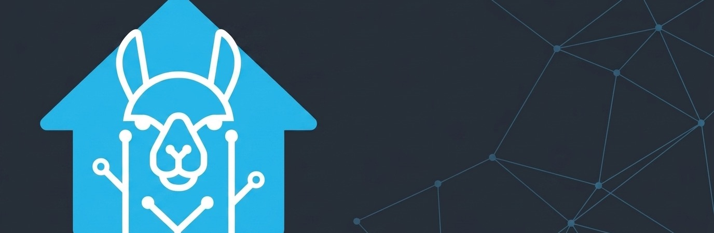

# Home Assistant llama.cpp Add-on

[](https://github.com/crysty0612/homeassistant-llamacpp-addon/actions)
[](https://my.home-assistant.io/redirect/supervisor_add_addon_repository/?repository_url=https%3A%2F%2Fgithub.com%2Fcrysty0612%2Fhomeassistant-llamacpp-addon)

<div align="center">
  
</div>

</div>

> ⚡ This version runs on **llama.cpp** [b10566](https://github.com/ggml-org/llama.cpp/releases/tag/b10566)

Run large language models (LLMs) directly on your Home Assistant server using the highly optimized [llama.cpp](https://github.com/ggml-org/llama.cpp) inference engine. This Add-on wraps `llama-server`, exposing a highly configurable, memory-efficient, OpenAI-compatible API endpoint directly on your local network.
## ✨ Features

- **Hugging Face Auto-Pull:** Simply enter the Hugging Face model repository and filename (e.g., `Qwen/Qwen2.5-0.5B-Instruct-GGUF:qwen2.5-0.5b-instruct-q4_k_m.gguf`). The Add-on will automatically download and cache it upon startup.
- **Vulkan GPU Acceleration:** Natively supports passing through host GPUs via Vulkan (`/dev/dri/renderD128`) for dramatically faster token generation on supported hardware.
- **Speculative Decoding (MTP / DFLASH):** Automatically handles advanced decoding strategies. Just configure a secondary drafter model and select your decoding strategy in the UI to squeeze the maximum tokens-per-second out of your hardware.
- **Multi-Modal Vision Support:** Automatically scans Hugging Face repositories for `*mmproj*.gguf` files. If a vision projection file is detected, it is automatically passed to the server, unlocking image analysis capabilities!
- **OpenAI-Compatible API:** The server inherently provides an OpenAI-compatible `/v1/chat/completions` endpoint for seamless integration into other software.

## 🚀 Installation

The easiest way to install this add-on is by using the **My Home Assistant** link below, which will directly import this repository into your Supervisor.

[](https://my.home-assistant.io/redirect/supervisor_add_addon_repository/?repository_url=https%3A%2F%2Fgithub.com%2Fcrysty0612%2Fhomeassistant-llamacpp-addon)

### Manual Installation
If the button above does not work for you:
1. Navigate to your Home Assistant dashboard.
2. Go to **Settings > Add-ons > Add-on Store**.
3. Click the **three dots** in the top right corner and select **Repositories**.
4. Paste the URL of this repository: `https://github.com/crysty0612/homeassistant-llamacpp-addon`
5. Click **Add**, then close the modal.
6. Scroll down to find the new "llama.cpp" add-on and click **Install**.

## ⚙️ Configuration & Usage

Navigate to the Add-on's **Configuration** tab. You will be presented with a highly structured UI. 

### Mandatory Fields
* **Main Model to load:** Provide the Hugging Face path to your model. You can specify the exact file or a partial name/pattern.
  * Format: `organization/repository:filename_or_pattern`
  * Example: `unsloth/Qwen3.5-9B-GGUF:UD-Q4_K_XL` or `Qwen/Qwen2.5-0.5B-Instruct-GGUF:qwen2.5-0.5b-instruct-q4_k_m.gguf`

### Recommended Advanced Settings
* **Context Size:** The maximum context window of the model (default `4096`). Increasing this will increase RAM usage.
* **Vulkan Hardware Acceleration:** Toggle this on if your HA server has a compatible GPU.
* **GPU Device Path:** Default is `/dev/dri/renderD128`. Only applicable if Vulkan is enabled.
* **Speculative Decoding:** To enable, specify a smaller `Drafter Model` and pick the `Drafter Type` (MTP or DFLASH).

### First Boot
On the first boot, the Add-on will reach out to Hugging Face and download the specified models. **This will take time** depending on your internet connection. 
Navigate to the Add-on's **Log** tab to watch the real-time download progress! Models are cached locally in your `/share` directory, so subsequent boots will be nearly instantaneous.

## 🔌 Connecting Home Assistant to the API

Once the Add-on says "Server is up and running" in the logs, `llama.cpp` will be exposing an OpenAI-compatible API directly to your Home Assistant internal network.

### Internal Connection (Recommended for HA Integrations)
For native integrations running on the same Home Assistant server, use the automatically generated internal hostname and the **fixed internal port 8080**:
```text
http://3927ed12-llamacpp:8080/v1
```
*(Note: Internal connections always use `8080` regardless of your Network port mapping).*

### External Connection (LAN / Outside HA)
If you want to access the API from another machine on your network (like a desktop app), use your Home Assistant's IP and the custom port you mapped in the Add-on's **Network** configuration:
```text
http://<YOUR_HA_IP>:<ADDON_PORT>/v1
```

To interact with your newly hosted local model directly from Home Assistant, we recommend the [Extended OpenAI Conversation](https://github.com/jekalmin/extended_openai_conversation) integration or [LLM Vision](https://llmvision.gitbook.io/getting-started) for multimodal support!
- **Base URL:** `http://3927ed12-llamacpp:8080/v1`
- **API Key:** `llama.cpp` (The key is ignored, but the field cannot be blank).

> See the **Documentation** tab in Home Assistant (or the `DOCS.md` file) for full integration guides!
